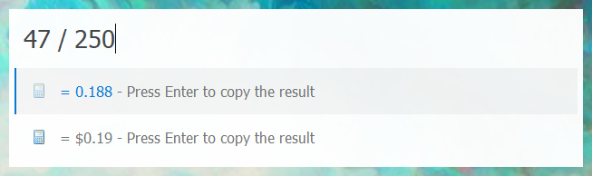

# Whitebat - A Light Keypirinha Theme

Whitebat is a theme for [Keypirinha](http://keypirinha.com/) that aims for a clean and elegant look.

## Installation
Add the text from `whitebat.ini` to your `Keypirinha.ini` configuration file to install the theme. A restart of Keypirinha may be required to fix any textbox issues.  

Note the theme itself is split into two parts, the layout and the color, allowing them to be enabled independently with the `theme` tag. Furthermore, the color section is easily modifiable with the `whitebat_xx` color variables.

## License
This work is licensed under the [MIT](https://opensource.org/licenses/MIT) license.
